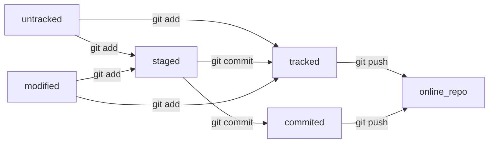

# Тренировочный проект для работы с Git.

---

## Инициализация папок и файлов.

---

1. Инициализировать репозиторий можно с помощью команды `git init`.
2. Проверить статус, или состояние, репозитория поможет команда `git status`.
3. Если вы ошиблись и случайно инициализировали не ту папку, можно «разгитить» её — удалить скрытую подпапку .git. `rm -rf .git`

## Добавление файлов в репозиторий.

---

1. Команда `git add` позволяет подготовить файл к сохранению.
2. Команда `git add --all` подготовит к сохранению сразу все файлы.
3. С помощью `git add .` можно добавить в репозиторий текущую папку со всеми файлами.

## Добавление коммита(приветствуется комментарий с описанием сделанных изменений).

---

1. Коммит можно сделать с помощью команды `git commit`.
2. Ключ -m позволяет присвоить коммиту сообщение. Помните, что такие сообщения должны быть информативными: чётко описывать изменения.
3. С помощью команды `git log` можно просмотреть историю коммитов.


## Загрузка на удалённый репозиторий. 

---

>Когда компьютеры обмениваются данными в сети, они следуют сетевым протоколам (англ. network protocols) — правилам обмена данными между компьютерами.
>Один из наиболее распространённых сетевых протоколов — *SSH* (от англ. Secure Shell Protocol). Он обеспечивает безопасный обмен данными в сети. С помощью этого протокола можно получать данные с удалённого компьютера или отправлять их на него. Трафик шифруется, поэтому протокол безопасен.
>*SSH* использует пару ключей для обеспечения безопасности — публичный и приватный: 
>Приватный ключ (англ. private key) хранится только на вашем компьютере и не должен передаваться кому-либо ещё. Он используется для расшифровки данных.
>Публичный ключ (англ. public key) доступен всем и используется для шифрования данных. Они могут быть расшифрованы парным приватным ключом.
>Только вы можете расшифровать данные с помощью приватного ключа, но любой владелец публичного ключа может их для вас зашифровать. Эти два ключа связаны и образуют SSH-пару. В будущем вы наверняка будете использовать их для взаимодействия с *GitHub* и другими удалёнными серверами.

- Для генерации SSH-пары используйте команду:

`ssh-keygen -t ed25519 -C "электронная почта, к которой привязан ваш аккаунт на GitHub"`

либо команду:

`ssh-keygen -t rsa -b 4096 -C "электронная почта, к которой привязан ваш аккаунт на GitHub"`

Если ваш пк не поддерживает протокол шифрования указанный выше.

2. Укажите место хранения ключей. Простой вариант — сделать домашний каталог пользователя путём по умолчанию. Для этого нажмите `Enter`.

3. Программа запросит кодовую фразу (англ. passphrase) для доступа к SSH-ключу. Вы можете оставить поле пустым. Для этого нажмите `Enter`, а затем ещё раз `Enter` для подтверждения.

4. Готово! Теперь осталось проверить, что ключи действительно сгенерировались. Для этого вызовите эту команду:
 
`ls -a ~/.ssh`

Итого:
- SSH — протокол, который обеспечивает безопасный обмен данными в сети и использует для этого ключи.
- SSH-ключ — ваш виртуальный идентификатор в GitHub. Как ключ от квартиры, он позволяет получить доступ к GitHub-репозиторию. Также SSH используется для доступа к другим удалённым серверам.
- SSH-ключ состоит из двух частей — публичной и приватной. Публичный ключ зашифрует данные, а приватный — расшифрует. Приватным ключом ни в коем случае нельзя делиться, иначе любой сможет расшифровать все ваши данные!

## Привязка удалённого репозитория к локальному.

---

1. Привязать удалённый репозиторий к локальному — `git remote add`.
Перейдите на страницу удалённого репозитория, выберите тип SSH и скопируйте URL. Кнопка справа позволит сделать это мгновенно.

`git remote add origin git@github.com:%ИМЯ_АККАУНТА%/first-project.git`

2. Убедиться, что репозитории связаны:

```
git remote -v
origin    git@github.com:%ИМЯ_АККАУНТА%/%ИМЯ-ПРОЕКТА%.git (fetch)
origin    git@github.com:%ИМЯ_АККАУНТА%/%ИМЯ-ПРОЕКТА%.git (push)
```

## Отправка изменений на удаленный репозиторий.

---

`git push -u origin main` <br> 

Если команда приведёт к ошибке, попробуйте заменить `main` на `master`.


## Хеширование

---
>Хеширование (от англ. hash, «рубить», «крошить», «мешанина») — это способ преобразовать набор данных и получить их «отпечаток» (англ. *fingerprint*).
>Информация о коммите — это набор данных: когда был сделан коммит, содержимое файлов в репозитории на момент коммита и ссылка на предыдущий, или родительский (англ. *parent*), коммит.
>Git хеширует (преобразует) информацию о коммите с помощью алгоритма SHA-1 (от англ. *Secure Hash Algorithm* — «безопасный алгоритм хеширования») и получает для каждого коммита свой уникальный хеш — результат хеширования.
>Обычно хеш — это короткая (40 символов в случае SHA-1) строка, которая состоит из цифр 0—9 и латинских букв A—F (неважно, заглавных или строчных). Она обладает следующими важными свойствами:
>если хеш получить дважды для одного и того же набора входных данных, то результат будет гарантированно одинаковый;
>если хоть что-то в исходных данных поменяется (хотя бы один символ), то хеш тоже изменится (причём сильно).


**Хеш — основной идентификатор коммита**
Git хранит таблицу соответствий `хеш → информация о коммите`. Если вы знаете хеш, вы можете узнать всё остальное: автора и дату коммита и содержимое закоммиченных файлов. Можно сказать, что **хеш — основной идентификатор коммита**.
При работе с Git хеши будут встречаться вам регулярно. Их можно будет передавать в качестве параметра разным Git-командам, чтобы указать, с каким коммитом нужно произвести то или иное действие.
Все хеши и таблицу `хеш → информация о коммите` Git сохраняет в служебные файлы. Они находятся в скрытой папке `.git` в репозитории проекта.

---

## Логи

- Можно вызвать не только полный лог, но и сокращённый — это делается командой `git log --oneline`.
- В сокращённом логе выводятся сокращённые хеши — их можно использовать точно так же, как и полные.

---

## Файл HEAD 

`HEAD` (англ. «голова», «головной») — один из служебных файлов папки `.git`. Он указывает на коммит, который сделан последним (то есть на самый новый).

Внутри `HEAD` — ссылка на служебный файл: `refs/heads/master` (или `refs/heads/main` в зависимости от названия ветки). Если заглянуть в этот файл, можно увидеть хеш последнего коммита.

Когда вы делаете коммит, Git обновляет `refs/heads/master` — записывает в него хеш последнего коммита. Получается, что `HEAD` тоже обновляется, так как ссылается на `refs/heads/master`

Итого:

- В числе прочих файлов в папке `.git` есть служебный файл `HEAD`. Он указывает на самый свежий коммит.
- Вместо хеша последнего коммита можно написать слово `HEAD` — Git вас поймёт.

---


## Возможные статусы файлов

- Статусы `untracked/tracked`, `staged` и `modified`

>Одна из ключевых задач Git — отслеживать изменения файлов в репозитории. Для этого каждый файл помечается каким-либо статусом. Рассмотрим основные.

- `untracked` (англ. «неотслеживаемый»)

>Мы говорили, что новые файлы в Git-репозитории помечаются как untracked, то есть неотслеживаемые. Git «видит», что такой файл существует, но не следит за изменениями в нём. У `untracked`-файла нет предыдущих версий, зафиксированных в коммитах или через команду `git add`.

- `staged` (англ. «подготовленный»)

>После выполнения команды `git add` файл попадает в staging area (от англ. stage — «сцена», «этап [процесса]» и area — «область»), то есть в список файлов, которые войдут в коммит. В этот момент файл находится в состоянии `staged`.

- `tracked` (англ. *«отслеживаемый»*)

>Состояние `tracked` — это противоположность `untracked`. Оно довольно широкое по смыслу: в него попадают файлы, которые уже были зафиксированы с помощью `git commit`, а также файлы, которые были добавлены в `staging area` командой `git add`. То есть все файлы, в которых Git так или иначе отслеживает изменения.

- `modified` (англ. «изменённый»)

>Состояние `modified` означает, что Git сравнил содержимое файла с последней сохранённой версией и нашёл отличия. Например, файл был закоммичен и после этого изменён.



---

## Стили оформления коммитов.

Например, правила могут быть такие:
- длина сообщения от 30 до 72 символов;
- первое слово — глагол в инфинитиве («исправить», «дополнить», «добавить» и другие);
- и так далее.

Во многих компаниях применяется `Jira` — система для организации проектов и задач. У каждой задачи в Jira есть идентификатор из нескольких заглавных латинских букв и номера. Например, `LGS-239` значит, что это
239-я задача в проекте `LGS` (сокращение от англ. logistics — «логистика»).
В корпоративном стиле в начале сообщения обычно указывают `Jira-ID`, а после — текст сообщения.
- `git commit -m "LGS-239: Дополнить список пасхалок новыми числами"`

В кратце:
- сообщение коммита легко читается;
- оно информативное;
- все сообщения оформлены в одном стиле.

---

## Изменение **последнего** коммита.

- `--amend` рассчитан на работу с последним коммитом `(HEAD)`.
- Дополнить коммит новыми файлами можно с помощью `git commit --amend --no-edit`. Благодаря опции `--no-edit` сообщение к коммиту останется таким, каким и было.
- Изменить сообщение к коммиту позволяет команда `git commit --amend -m "Обновлённое сообщение коммита"`.

---

## Изменения более **ранних** коммитов.

- Команда `git restore --staged <file>` переведёт файл из `staged` обратно в `modified` или `untracked`.
- Команда `git reset --hard <commit hash>` «откатит» историю до коммита с хешем `<hash>`. Более поздние коммиты потеряются!
- Команда `git restore <file>` «откатит» изменения в файле до последней сохранённой (в коммите или в `staging`) версии.

---

## Просмотр изменений в файлах.

`git diff`
- Первые две строки (`diff --git a/... b/...` и `index 901da07..ac459e1 100644`) — это низкоуровневая техническая информация. Мы не будем на ней останавливаться.
- Строки `--- a/somefile` и `++ b/samefile` говорят, что дальше будет выведен результат сравнения файлов `a/somefile` и `b/samefile` — исходной и текущей версий.
- Строка `@@ -1,2 +1,2 @@` сообщает, какие строки файла попали в сравнение. Выражение 1,2 (неважно, с плюсом или с минусом) говорит, что были использованы две строки, начиная с первой. Если бы было, например, написано +15,7, это значило бы, что в сравнении участвуют 7 строк, начиная с 15-й.

- Выражение со знаком минус (-1,2) относится к «оригинальной» версии файла (a/somefile), а со знаком плюс (+1,2) — к «изменённой» (b/samefile).

- Чтобы посмотреть разницу между двумя коммита используется команда `git diff <хэш_коммита> <хэш_коммита2>` 


Важно!

- Чтобы всё-таки просмотреть изменения в `staged`, нужно использовать флаг `--staged:` `git diff --staged`.

---

## Игнорирование файлов для отправки на удалённый репозиторий.

Чтобы Git игнорировал такие файлы и не пытался добавить их в репозиторий, нужно создать файл `.gitignore` (от англ. ignore — «игнорировать») и записать в него названия игнорируемых файлов.

В простейшем случае в `.gitignore` указывают все файлы, которые нужно игнорировать (по одному имени на строку). Но часто удобнее использовать шаблоны. Шаблон, или правило, — это способ указать сразу на несколько файлов с однотипными названиями.

- Если строка начинается с #, то это комментарий, и `.gitignore` не будет его учитывать.

- Символ звёздочки (`*`) соответствует любой строке, включая пустую. Если такой символ используется в шаблоне в `.gitignore`, значит, файл будет проигнорирован вне зависимости от того, что будет на месте звёздочки.

```
# игнорировать все файлы, которые заканчиваются на .jpeg
*.jpeg

# игнорировать все файлы "tmp" во всех подпапках папки docs
docs/*/tmp
```

- Вопросительный знак `?` соответствует одному любому символу.

`file?.txt`

Если сохранить такую запись в `.gitignore`, то будут проигнорированы, например, файлы `fileA.txt` и `file1.txt`. А вот файл `file12.txt` не будет проигнорирован, потому что в его названии два символа после `file`, а не один.

- Квадратные скобки (`[…]`)
Квадратные скобки, как и вопросительный знак, соответствуют одному символу. При этом символ не любой, а только из списка, который указан в скобках.

```
# игнорировать файлы file0.txt, file1.txt и file2.txt
# при этом не игнорировать file3.txt, file4.txt, ...
file[0-2].txt
```

- Слеш (`/`)
Косая черта, или слеш (`/`), указывает на каталоги. Если шаблон в `.gitignore` начинается со слеша, то Git проигнорирует файлы или каталоги только в корневой директории.

```
# игнорировать todo.txt в корне репозитория
/todo.txt

# для сравнения: spam.txt будет игнорироваться во всех папках
spam.txt
```

- Парные звёздочки (`**`)
Функция парных звёздочек (`**`) похожа на функцию одинарной (`*`). Отличие в том, как они работают с вложенными папками. Двойная звёздочка может соответствовать любому количеству таких папок (в том числе нулю). Одинарная может соответствовать только одной.

```
# игнорировать файлы "docs/current/tmp", "docs/old/tmp",
# а также "docs/old/saved/a/b/c/d/tmp"
# и даже "docs/tmp", потому что ноль вложенных папок тоже подходит
docs/**/tmp

# игнорировать только "docs/current/tmp" и "docs/old/tmp"
# файл "docs/old/saved/a/b/c/d/tmp" не попадает в правило
docs/*/tmp
```

- Восклицательный знак (`!`)
Любое правило в файле `.gitignore` можно инвертировать с помощью восклицательного знака (`!`).

```
# игнорировать все JPEG-файлы
*.jpeg

# но только не мем с Doge
!doge.jpeg
```

- `.gitignore` и `git status`
Игнорируемые файлы не отображаются в выводе команды `git status`, иначе они бы засоряли вывод.
Если всё же нужно отобразить все игнорируемые файлы, то это можно сделать с помощью ключа `--ignored`: `git status --ignored`. В таком случае в выводе `git status` появится раздел `Ignored files`.

Итого:
- Если нужно, чтобы Git игнорировал какие-то файлы, стоит составить файл `.gitignore`.
- Посмотреть, что игнорируется, можно с помощью команды `git status --ignored`.
- Сам файл `.gitignore` — это обычный файл в репозитории. Его тоже стоит закоммитить.

---

*README.md* — текстовый файл, который можно создать командой **touch**, а затем редактировать так же, как и любой другой текстовый документ. Например, в блокноте.

Преимущество *README.md* в том, что средства командной работы (такие, как GitHub) могут отображать его содержимое в браузере в виде удобной разметки.

Для этого нужно не просто залить текст, но и настроить шрифт, заголовки и отступы с помощью **markdown**.

*Маркда́ун* — это специальный язык разметки.

Он позволяет красиво отформатировать текстовый документ.

---

## Пример вставки кода в файл

```JavaScript
function closure () {
	let count = 0; 
	return () => count++
};

let counter = closure()
let counter1 = closure()

console.log(counter()) //0
console.log(counter()) //1
console.log(counter()) //2
console.log(counter()) //3
console.log(counter()) //4
console.log(counter1()) //0
console.log(counter1()) //1
console.log(counter()) //5
```

[Markdown Cheat Sheet](https://www.markdownguide.org/cheat-sheet/ "Клик")